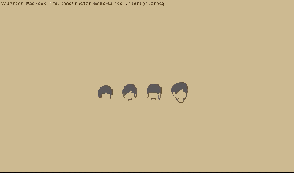

# Constructor-Word-Guess
This project terminal-based word guess game using Node.js constructors.  The game is started by entering "node index" into the terminal command line, then follow the prompts to guess letters in determining the word.  This particular game consists of randomly selected names of my favorite authors :)  The player will have 10 chances to guess the word correctly, otherwise game over.

## Getting Started
To obtain a copy of this app, please visit https://github.com/valeriemiller5/Constructor-Word-Guess 

## Prerequisites
The package.json is included in the Github repository.  In order to run this app, the user will need to install the package.
'npm install'

### These packages are required to play the game:
### inquirer
`npm install inquirer`
### chalk
`npm install chalk`

## Demo

## Issues Encountered
While working on this project, there were some issues with formatting the underscore appearance in the terminal (they currently sit side-by-side instead of having a slight space between each).  The final prompt asking if the player wants to replay the game still has the same response whether the user selectes "y" or "n".

## Built With
* Node.js - language used to build the app
* Chalk - a Node.js package used to prettify the data in the terminal with colors
* Inquirer - a Node.js package used to create question prompts

## Authors
Valerie Flores - Initial work

## License
This project is licensed under the MIT License - see the LICENSE.md file for details

## Acknowledgments
Thank you to UCI Coding Bootcamp classmates for your help and suggestions, and the many examples of other coders online.